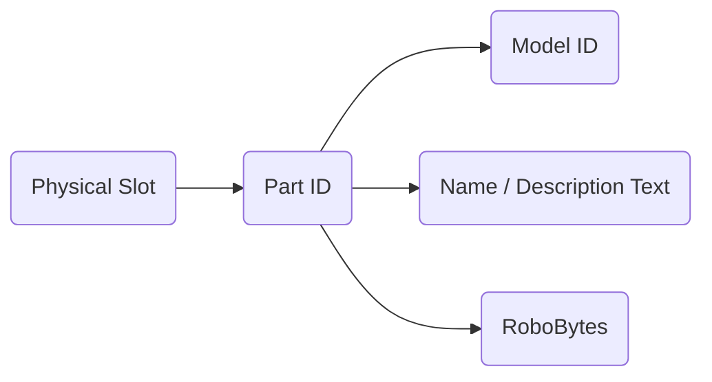
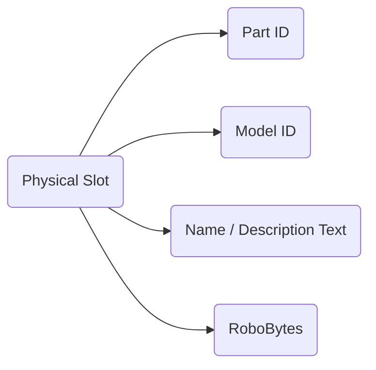

# CRBR-Parts-Expansion
This is a set of codes for Custom Robo Battle Revolution (Gamecube) that allows anyone to clone existing parts and customize their parameters. It is built using GCTRM and is used alongside Riivolution (Dolphin) or Geckoloader (GCN / Wii) to bypass codeset size restrictions. This build also includes all of the most commonly used codes.

## Features
- Allows up to 255 of each part type to be added to the game
- Designed with GCTRM for readability of files and codes, and utilizes Riivolution / Gecko Loader to bypass all codeset size restrictions.
- All parts are individual text files that can be edited via Notepad++ / VSC
- Includes popular codes that are found in existing Custom Robo mods, such as Unlock All Parts and Synchronized Spawns.

## How it Works
In an unmodified copy, when a part would be selected on the Part Select, the physical slot selected would be attached to the Parts ID, and all of the part Data, such as the Name, Description, Model ID, and RoboBytes would be loaded based off of the part ID. This means that the total amount of parts available would be limited to the amount of Part IDs. Guns / Bombs / Pods / Legs all had ~12 hidden additional slots that were development testing parts, but there were no additional slots for bodies.

This mod works by detaching all of this information for the Part ID and attaching it to the Physical Slot. The total amount of each part that can be added is 255 per part type, as now the amount of slots is limited to the amount of physical slots available.

## Limitations
Currently, there is no way to add unique models / GFX / SFX to the game. Due to this, all parts are visually derivative of other existing parts. Due to the way the game stores its files, i do not think this limitation will ever be bypassed.

## Installation (Dolphin)
1. Download a version of Dolphin that has Riivolution Compatibility. The most recent Beta is always a safe option.
2. Setup Dolphin and your copy of Custom Robo as you normally would, but include the following code. This code will allow the game to utilize the codes loaded in by Riivolution
External Codeset [DesiacX] 
21800000 00D0C0DE 
21800004 00D0C0DE 
4E000018 00000000 
4C000000 00001858 
04001848 81800008 
64000000 00000000 
E0000000 80008000

3. In config, go to Advanced and enable "enable Emulated Memory Size Override", then set it to 32mb.
4. Right Click your copy of Custom Robo and click "Start with Riivolution Patches".  Enable "External Codeset". 
5. Save the Riivolution Preset where ever you store your games.
6. Start the game using the saved Riivolution preset .
7. (Netplay) Right click the saved Riivolution preset and click "Start Netplay". All player must have all of the same files and the same Riivolution configuration.

## Installation (Gamecube)
Utilize tools like [GCFT](https://github.com/LagoLunatic/GCFT "https://github.com/LagoLunatic/GCFT") to extract and insert the main.dol, and utilize [this specific version of GeckoLoader](https://github.com/sup39/GeckoLoader/releases/tag/v7.1.0-sup39 "https://github.com/sup39/GeckoLoader/releases/tag/v7.1.0-sup39") to patch the main.dol with the compiled GCT. Use the following settings for Gecko Loader to properly work. Codehandler set to Full, Code Hook set to GC, Include Codes set to ALL, and in advanced settings, **turn off optimize codes**.

In addition, remove the code "External Codeset Closer [DesiacX]" from the codeset and recompile the GCT before putting it into the main.dol.
