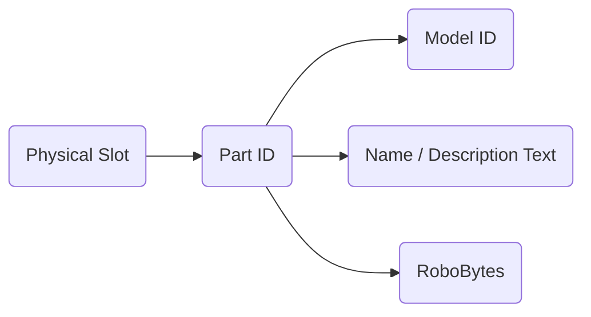
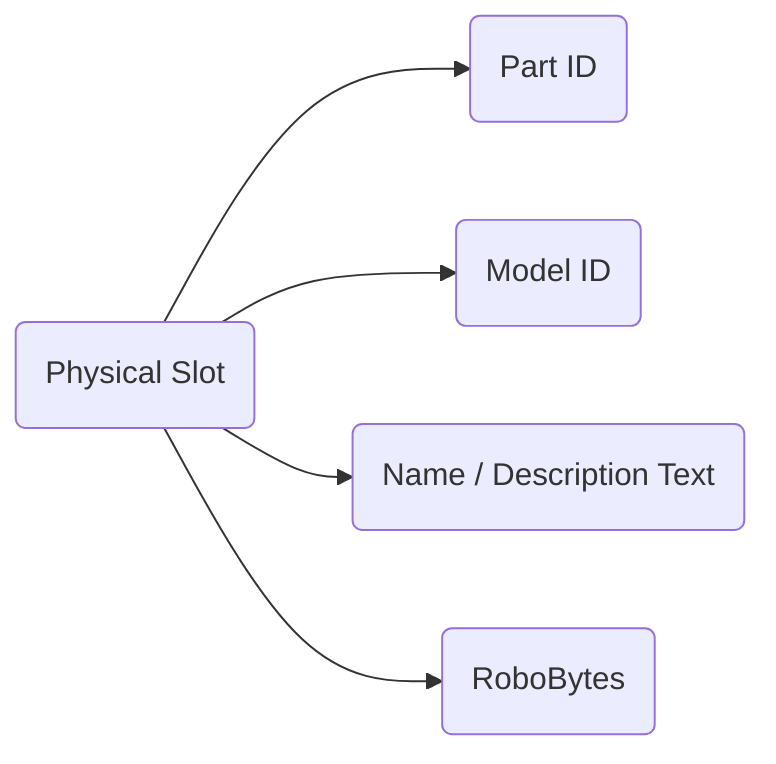

# CRBR-Parts-Expansion
This is a set of codes for Custom Robo Battle Revolution (Gamecube) that allows anyone to clone existing parts and customize their parameters. It is built using GCTRM and is used alongside Riivolution (Dolphin) or Geckoloader (GCN / Wii) to bypass codeset size restrictions. This build also includes all of the most commonly used codes.

## Features
- Allows up to 255 of each part type to be added to the game
- Designed with GCTRM for readability of files and codes, and utilizes Riivolution / Gecko Loader to bypass all codeset size restrictions.
- All parts are individual text files that can be edited via Notepad++ / VSC
- Includes popular codes that are found in existing Custom Robo mods, such as Unlock All Parts and Synchronized Spawns.

## How it Works
In an unmodified copy, when a part would be selected on the Part Select, the physical slot selected would be attached to the Parts ID, and all of the part Data, such as the Name, Description, Model ID, and RoboBytes would be loaded based off of the part ID. This means that the total amount of parts available would be limited to the amount of Part IDs. Guns / Bombs / Pods / Legs all had ~12 hidden additional slots that were development testing parts, but there were no additional slots for bodies.



This mod works by detaching all of this information for the Part ID and attaching it to the Physical Slot. The total amount of each part that can be added is 255 per part type, as now the amount of slots is limited to the amount of physical slots available.



## Limitations
Currently, there is no way to add unique models / GFX / SFX to the game. Due to this, all parts are visually derivative of other existing parts. Due to the way the game stores its files, i do not think this limitation will ever be bypassed.

## Future Potential
- It is possible to make custom Robobytes. For example, it would be possible to add bytes to Legs to check to see if Lava will effect them.
- It is possible to utilize the hidden development part IDs to create new functions via hard coding. For example, 3 new parts in the build utilize the first hidden leg slot. When that specific Part ID is used, an additional jump is added to the Body part.

## Installation (Dolphin)
1. Download a version of Dolphin that has Riivolution Compatibility. The most recent Beta is always a safe option.
2. Setup Dolphin and your copy of Custom Robo as you normally would, but include the following code. This code will allow the game to utilize the codes loaded in by Riivolution
```
External Codeset [DesiacX]
200000F0 02000000 
21800000 00D0C0DE 
21800004 00D0C0DE 
4E000018 00000000 
4C000000 00001858 
04001848 81800008 
64000000 00000000 
E0000000 80008000
```
3. In config, go to Advanced and enable "enable Emulated Memory Size Override", then set it to 32mb.
4. Right Click your copy of Custom Robo and click "Start with Riivolution Patches" and open GXCE.xml. Enable "External Codeset". 
5. Save the Riivolution Preset where ever you store your games.
6. Start the game using the saved Riivolution preset .
7. (Netplay) Right click the saved Riivolution preset and click "Start Netplay". All player must have all of the same files and the same Riivolution configuration.

## Installation (Gamecube)
Utilize tools like [GCFT](https://github.com/LagoLunatic/GCFT "https://github.com/LagoLunatic/GCFT") to extract and insert the main.dol, and utilize [this specific version of GeckoLoader](https://github.com/sup39/GeckoLoader/releases/tag/v7.1.0-sup39 "https://github.com/sup39/GeckoLoader/releases/tag/v7.1.0-sup39") to patch the main.dol with the compiled GCT. Use the following settings for Gecko Loader to properly work. Codehandler set to Full, Code Hook set to GC, Include Codes set to ALL, and in advanced settings, **turn off optimize codes**.

## Compiling the Codeset
To compile the codeset file (GXCE01.gct), drag and drop GXCE01.asm onto GCTRealMate.exe. To output a Codeset.txt, which contains a regular gecko text codeset, drag and drop GXCE01.asm onto GCTRM-Log.bat

## Understanding Part Files
Each part has a file associated to it, and all files follow a similar structure.
- PartType. This signifies what kind of part it is. This will never be changed, and will always be based on the part you choose to edit or base your part of.
- PartBase. This ID determines what the base part is, and will utilize any hardcoded elements of that taunt. For example, the Charge attack from Bodies and the Bullet Model for the Gun.
- ModelID. This determines the model used for the part. This does not have to match the PartBase.
- PartName / PartDescription. The Part Name and Description.
- RoboBytes. RoboBytes are the parameters of all the parts. They determine how heavy the body is, how many bullets are shot from a gun, or how fast the leg is. This is what makes any part unique. The RoboByte maps can be found here [here](https://docs.google.com/spreadsheets/d/1xMTUvEPd0IhIkLBRpwaBkMJw2oo_JkgNmZ03lfrr2gE/edit#gid=0 "https://docs.google.com/spreadsheets/d/1xMTUvEPd0IhIkLBRpwaBkMJw2oo_JkgNmZ03lfrr2gE/edit#gid=0").

## Adding / Removing Part Files
To add or remove parts, simply open the PartsList.asm file found in Parts/PartData/CRBR/. The parts are added to the game in the order they appear in this file, so it is possible to re-organize the parts list simply by moving the text in these files around. In addition by editing GXCE01.asm, it is possible to add an entire custom part list or an entirely seperate builds part list.

## Included Codes
- Tournament Codes
  - Unlock Everything [????]
  - Synchronized Spawns V2 [DesiacX]
  - HP Defaults to 70% for Tag Battles in V.S. Mode V2 [DesiacX]
  - Stagelist Toggle (Tournament / Vanilla), ZAlt Stages, and Stage Disablers [DE:, DesiacX]
  - Illegal Parts enabled on startup [DesiacX]
- QOL Codes
  - Universal Settings Modifier v1 [DesiacX]
  - Temporarily Disable Illegal Parts by holding R [DesiacX]
  - Remember Parts Selection [DesiacX]
  - Boot to Main Menu v1.1 [DesiacX]

## Redistribution and Crediting
When creating parts based off of others or redistributing them in builds, you must properly credit them where possible. In every code title, there is a part of the name for credits. Please utilize that to credit yourself and others who contributed.

## Credits
- All included codes are creditted in the title where possible.
- The Custom Robo Netplay [Discord](https://discord.gg/qPXvwdeT3V "https://discord.gg/qPXvwdeT3V"). The framework for editing parts and various documentation was provided by members of this community.
- GCTRealMate was created by DukeItOut and distributed in the mod [Project+](https://projectplusgame.com/ "https://projectplusgame.com/") for Super Smash Brothers Brawl. This mod is impossible without it.


